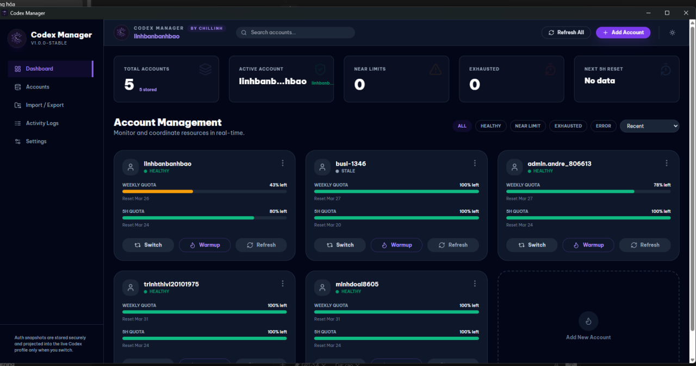
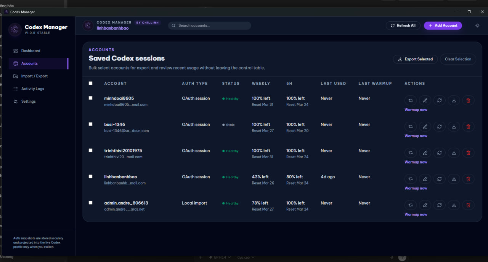
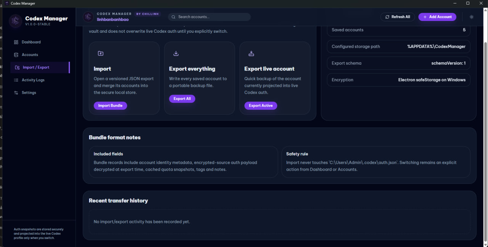
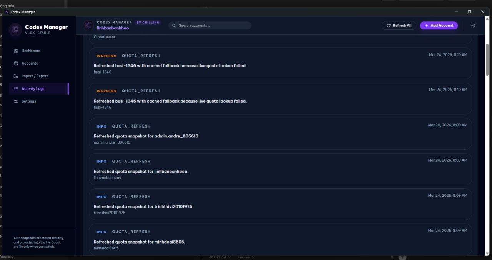
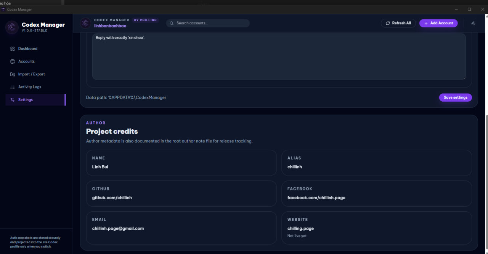

# Codex Manager

Switch Codex accounts in 1 click, monitor quota, and manage sessions from a clean Windows desktop app.

> Current release phase: public Windows build first. Full source code will be released later.




## Download

- Windows installer: [Download the latest build](https://github.com/chillinh/codex-manager/releases/latest/download/codex-manager-setup-windows-x64.exe)
- Release page: [GitHub Releases](https://github.com/chillinh/codex-manager/releases)

## Why Codex Manager

Codex Manager is built for people who work with multiple Codex accounts and need a faster desktop workflow for switching sessions, watching quota, and keeping account state organized without manual file juggling.

## Features

- One-click account switching
- Quota monitoring dashboard
- Warmup flow for account sessions
- Import and export for account bundles
- Desktop-first workflow for Windows
- Clean dark UI designed for focused daily use

## Screenshots

### Dashboard


### Accounts



### Import / Export



### Activity Logs



### Settings



## What This Repository Contains

This repository currently focuses on distribution:

- Windows installer builds
- Product screenshots
- Public release notes and download links

Full source code is planned for a later public release.

## Source Code Status

The current repository is being used as the public distribution page for:

- installer releases
- screenshots
- release notes

The application source code is not fully published yet, but it is planned for a future update.

## Direct Link For Website Button

If your website download button should always fetch the newest installer from GitHub, use this stable URL:

```txt
https://github.com/chillinh/codex-manager/releases/latest/download/codex-manager-setup-windows-x64.exe
```

As long as every release uses the same asset name, the link will always download the newest version automatically.

## Integrity

For each release, upload the installer together with `SHA256SUMS.txt` so users can verify the downloaded file.

## Author

- Linh Bui
- GitHub: [@chillinh](https://github.com/chillinh)
- Facebook: [chillinh.page](https://facebook.com/chillinh.page)
- Email: chillinh.page@gmail.com
- Website: `chilling.page` (coming soon)

## Notes

- The app is currently distributed as a Windows executable build.
- If Windows SmartScreen appears, users can verify the file hash from the release page before installing.
